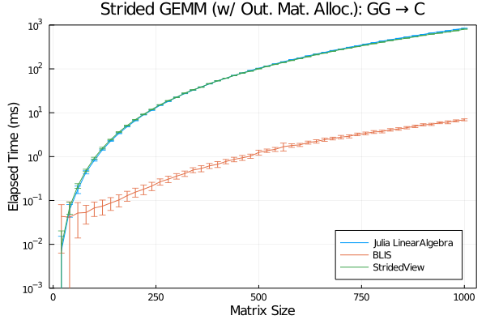

BLIS.jl
=======

[![][docs-dev-img]][docs-dev-url] [![CI][github-img]][github-url] [![][codecov-img]][codecov-url]

[docs-dev-url]: https://xrq-phys.github.io/BLIS.jl/dev
[docs-dev-img]: https://img.shields.io/badge/docs-dev-blue.svg
[github-img]: https://github.com/xrq-phys/BLIS.jl/workflows/CI/badge.svg
[github-url]: https://github.com/xrq-phys/BLIS.jl/actions?query=workflow%3ACI
[codecov-img]: https://codecov.io/gh/xrq-phys/BLIS.jl/branch/master/graph/badge.svg
[codecov-url]: https://codecov.io/gh/xrq-phys/BLIS.jl

This repository provides:

- Wrapper for typed and object-based interface of [BLIS](https://github.com/flame/blis).
- Overwrite of `LinearAlgebra.BLAS` functions so that matrix
  multiplications can also be redirected to the BLIS backend.
- As BLIS itself is using actively templates and macros, 
  this package also aims to maximize usage of Julia's
  metaprogramming features.

## Performance



Above is a benchmark result obtained against generic-strided matrix multiplications. More performance results are available [here](docs/src/performance.md).

## Installation
```
]add https://github.com/xrq-phys/BLIS.jl
```

## Usage

Basically by `using BLIS` one replaces `LinearAlgebra` with BLIS routines as its backends. This should allow direct computation (computation without copying) of generic strided matrices and mixed-datatype matrices. In addition to that BLIS' typed and object-based API are exposed as backends. See [documentation][docs-dev-url] for more details.

## Roadmaps

- Provide option to compile BLIS into Julia startup image.
- Incorporate [HPAC/Linnea](https://github.com/HPAC/linnea) in this
  or another repository.
