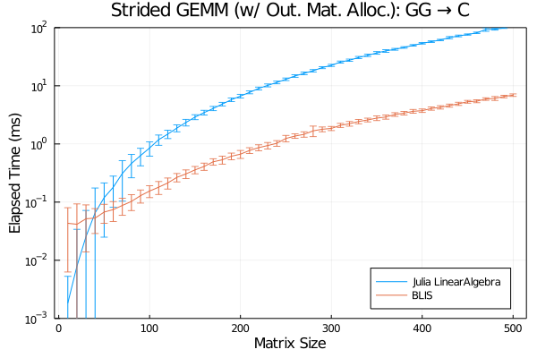

# More on Generic-Strided Performance

Column-major matrix-matrix products (usual case) are handled with BLAS libraries in `LinearAlgebra`. Common options here include:

- OpenBLAS (default)
- MKL ([MKL.jl](https://github.com/JuliaComputing/MKL.jl))

Comparison of BLIS against other popular BLAS vendors is available in [this section of BLIS documents](https://github.com/flame/blis/blob/master/docs/Performance.md). This short article, instead, lists performance benchmarks of generic-strided matrix-matrix multiplications which is not supported by BLAS thus handled with plain loops in `LinearAlgebra`. [Strided.jl](https://github.com/Jutho/Strided.jl) which provides sophisticated tailoring of all kinds of strided arrays is also included in this test.

## Linux, AVX512

- OS: CentOS 7
- Processor: Intel(R) Xeon(R) Platinum 8260
- FP Pipeline: 2 AVX512 pipelines
- OpenMP Thread Used: 4

## macOS, AVX2

- OS: macOS 10.15.7
- Processor: Intel(R) Core(R) i5 8259U
- FP Pipeline: 2 AVX2 pipelines
- OpenMP Thread Used: 4

